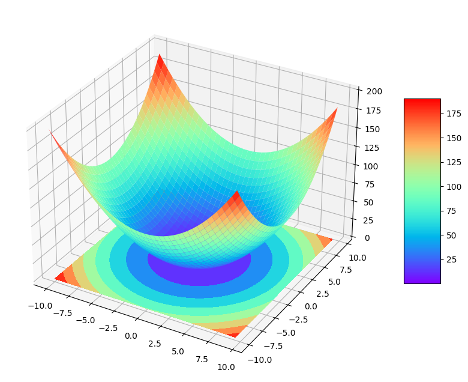

# Contour Plot – 3D Visualization of a Function

## What is this about?

This notebook demonstrates how to create a 3D surface plot with contour projection using matplotlib and numpy. It is part of my machine learning journey to understand mathematical functions, surfaces, and data visualization techniques.

## What did I learn?

- How to generate 3D surface plots in Python using matplotlib.

- How to add contour plots projected on different planes (in this case, Z-plane).

- How to use np.meshgrid() to create a coordinate matrix from two vectors.

- Basics of using plot_surface() and contourf() for function visualization.

## Algorithm / Function

`Z = X2 + Y2`

Where:

- X∈[−10,10]

- Y∈[−10,10]

We use np.meshgrid to create the input grid, and then compute 

## Dataset

This section does not use any external dataset.

All values are synthetically generated using numpy.arange():

<pre>x = np.arange(-10, 10, 0.5)

y = np.arange(-10, 10, 0.5)

X, Y = np.meshgrid(x, y)

Z = X**2 + Y**2</pre>

## Output Example

Here is an example of the 3D surface with contours:

  

The surface is colored using a rainbow colormap, and the contour lines are projected onto the Z=0 plane.

## Technologies Used

* Python 3.x

* NumPy

* Matplotlib (with mpl_toolkits.mplot3d)

## Files

- contour_plot.ipynb: Jupyter Notebook with all the code.

- images/contour-diagram-plot.png: Output image for the contour plot.

- README.md: This file.

## How to Run

Clone the repository and run the notebook:

git clone https://github.com/your-username/your-repo.git
cd your-repo
jupyter notebook contour_plot.ipynb

